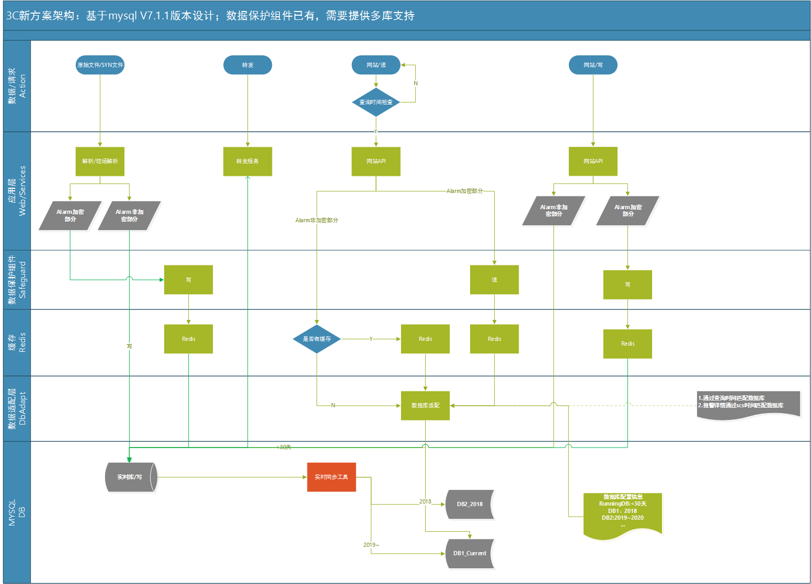

3C doc - 基于MySQL统一模型的解决方案
=================
  
版本修订
-----------------------------------

日期 | 作者 |  说明
-|-|-
2020/03/05|xuyong| add：V8.0.0

方案说明
-----------------------------------

该设计基于mysql V7.1版本，依据2020/3/4动车3C性能讨论结果为指导，从下面的几方面考虑：

1. 统一模型：主要是alarm，c3_sms
2. 读写分离:热数据写到实时库，通过工具同步到历史库
3. 应用层:控制请求实现系统的自我保护
4. 内存数据库应用
5. 中间表设计
6. mysql的性能要求
7. 对内需求

开发和升级计划（3个阶段）
-----------------------------------

1. 对外Mysql性能提升：统一模型，读写分离等性能问题
2. 对内版本功能完善：将对内需求在mysql版本实现，主要涉及解析服务/网站
3. 对内Oracle迁移mysql，系统升级

参考资料
-----------------------------------

[加密解密数据保护方案](../安全加固/数据安全加密和解密详细设计.md)  

设计框架
-----------------------------------

数据模型统一
-----------------------------------

模型重构：将alarm_aux/alarm_img关联表的部分字段合并至alarm，达到列表查询时不再关联的效果。 [参考](../安全加固/数据安全加密和解密详细设计.md)  

1. alarm
2. c3_sms

数据分库设计：读写
-----------------------------------

数据库按实时库和历史库设计，数据写入实时库后，通过工具同步到历史库；读取数据时通过数据库适配组件获取对应日期的数据库实例，返回数据；任何修改数据仅针对实时库。

1. 写数据
    1. 解析服务
    2. 现场解析服务
    3. 网站
    4. 转发服务
2. 读数据
    1. 网站
    2. 报表服务

数据分库设计：数据库访问适配
-----------------------------------

1. 数据库配置
    1. 实时库：可以配置一个适当的天数，超过这个天数的数据都会移除，只能到历史库查询，实时库就是存热数据的历史库。
    2. 历史库：每个年度库可以配置一个时间段，通过查询时间适配数据库。
2. 数据库适配：通过查询的时间条件，依据数据库的时间配置参数，获取存储数据的地址

敏感数据的保护
-----------------------------------

参考上个版本的设计，[加密解密数据保护方案](../安全加固/数据安全加密和解密详细设计.md)

对内需求
-----------------------------------

还需要在SPRINT2之前整理出来

解析服务
-----------------------------------

1. 模型重构（SPRINT2）
2. 敏感数据保护（SPRINT2）

网站
-----------------------------------

1. 模型重构（SPRINT1）
2. 读写分离（SPRINT1）
3. 对内业务（SPRINT2）

提图服务
-----------------------------------

1. 对内图片路径存储支持（SPRINT2）
2. 分库支持（SPRINT1）

转发服务
-----------------------------------

1. 模型重构（SPRINT1）
2. 性能优化：trans_data表数据太大，获取待处理数据效率低（SPRINT2）

报表服务
-----------------------------------

1. 模型重构（SPRINT1）
2. 性能优化：使用redis缓存替换轮询数据库（SPRINT1）
3. 分库支持（SPRINT1）

主动检测
-----------------------------------

1. 敏感数据加密支持（SPRINT2）

SYN转发服务
-----------------------------------

1. 模型重构（SPRINT2）

AI相关服务
-----------------------------------

/
