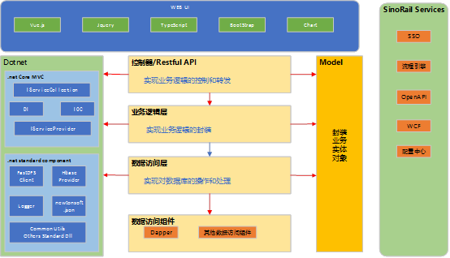

3C developer doc - dotnet core开发规范
=================
  
开发架构
-----------------------------------


asp.net core 
-----------------------------------
  asp.net core mvc/api 
  

配置文件
-----------------------------------
### App.setting
    TODO:THE CODE 
```JSON
{
    //连接字符串
    "ConnectionStrings": {
    "IsEncryption": "0",
    "DbProvider": "Oracle.ManagedDataAccess.Client",
    "ConnectionString": "data source=192.168.1.250/bownet;password=123456Aa;user id=dtctest;"
    },
    "fastdfs.address": "192.168.1.231:22122,192.168.1.232:22122",
    "fastdfs.group": "group0",
    "hbase.dfsTable": "alarmTest",
    "hbase.address": "192.168.1.231:9090",
    "hbase.connectCount": "5",
    "redis.connectionString": "192.168.1.231:7001,192.168.1.231:7002,192.168.1.231:7003,192.168.1.231:7004,192.168.1.231:7005,192.168.1.231:7006,password=,connectTimeout=1000,connectRetry=1,syncTimeout=10000"
}

```
###  MIS_PARAMETER
TODO:THE CODE 
```DB
```

Git 版本使用
-----------------------------------
    1.git code  
    2.修改代码，commit to local,push to 远程分支  
    3.测试通过后tag  
    4.merge to master  


接口调用或示例代码
-----------------------------------
### 依赖注入开发规范
    Startup.cs
```c# 
    // 单个读取配置，支持对象序列化的读取
    string isEncryption = Configuration["ConnectionStrings:IsEncryption"];
    string dbProviderString = Configuration["ConnectionStrings:DbProvider"];
    string password = Configuration["ConnectionStrings:ConnectionString"];
```
```c# 
    // 注册数据访问组件
    services.AddSingleton(typeof(SinoRail.DataProvider.DataContextFactory), dbFactory);
    // 注册数据库访问类
    services.AddScoped(typeof(IAlarmDataAccess), typeof(AlarmDataAccess));
    services.AddScoped(typeof(IAlarmService), typeof(AlarmImpl));
    // 注册业务组件
    services.AddScoped(typeof(IAlarmParsedDataAccess), typeof(AlarmParsedDataAccess));
    services.AddScoped(typeof(IAlarmParsedService), typeof(AlarmParsedImpl));
```
    AlarmParsedController.cs
```c# 
    // 构造函数参数中初始化业务类，禁止跨层调用数据访问类，建议注入方式实例化对象
    public class AlarmParsedController : ControllerMaster
    {
            IAlarmParsedService _alarmService;
            /// <summary>
            /// AlarmParsed WEB API
            /// </summary>
            /// <param name="options">配置信息</param>
            public AlarmParsedController(IAlarmParsedService alarmService)
            {
                _alarmService = alarmService;
            }
    }
```
```c# 
    /// <summary>
    /// 报警解析数据类
    /// </summary>
    public class AlarmParsedImpl : IAlarmParsedService
    {
        IAlarmParsedDataAccess alarmDataAccess = null;

        // 构造函数初始化数据访问对象
        public AlarmParsedImpl(IAlarmParsedDataAccess dataAccess)
        {
            this.alarmDataAccess = dataAccess;
        }
    }
```
```c# 
    // 数据访问层统一使用DataContextFactory读写数据，DataContextFactory默认实现了大部分dapper访问接口
    public class AlarmParsedDataAccess : IAlarmParsedDataAccess
    {
        DataContextFactory DbContextFactory = null;
        SinoRail.DataProvider.Analyzer.AbsAnalyzer sqlAnalyzer = null;
        /// <summary>
        /// 报警数据访问类
        /// </summary>
        /// <param name="contextFactory"></param>
        public AlarmParsedDataAccess(DataContextFactory contextFactory)
        {
            this.DbContextFactory = contextFactory;
            sqlAnalyzer = SinoRail.DataProvider.Analyzer.SqlAnalyzerFactory.GetAnalyzer(DbContextFactory.DataProvider.DatabaseType);
        }
        
        // sql查询示例代码
        public List<object> GetSummary(DateTime begin, DateTime end)
        {
            List<object> lst = new List<object>();
            try
            {
                string query = sqlAnalyzer.Process(DBSqls.SUM_ALARM_PARSED_SUMMARY);
                using (IDataContext context = DbContextFactory.Create(true))
                {
                    lst = context.QueryList<object>(query, new { begin = begin, end = end });
                }
            }
            catch (Exception ex)
            {
                SinoRail.Common.Log.Logger.Current.Error(ex.StackTrace);
                lst = null;
            }
            return lst;
        }
    }

    // 统一定义sql
    public class DBSqls
    {
        // 报警查询
        public const string SUM_ALARM_PARSED_COSTTIME = @"
        select t.clientname,count(*) nums, round(avg((t.parsedtime-t.downtime)*(24*60*60)),0) avgtime  from log_consumer_alarm t 
        where t.collecttime>@begin and t.collecttime<@end and t.finalstatus=1
        group by t.clientname order by t.clientname
        ";
        public const string SUM_ALARM_PARSED_DAYS = @"
        select days, sum(nums) nums,sum(succ) succ,sum(fail) fail from(
        select to_char(t.collecttime,'yyyymmdd') days,1 nums,decode(t.status,200,1,0) succ,decode(t.status,200,0,1) fail  from log_consumer_alarm t 
        where t.collecttime>@begin and t.collecttime<@end 
        ) group by days order by days 
        ";
    }
``` 
### docker file
```
    FROM microsoft/dotnet:2.1-aspnetcore-runtime AS base
    EXPOSE 8091
    EXPOSE 8092
    COPY app/bin/Release/netcoreapp2.1/publish/ app/
    WORKDIR /app
    ENTRYPOINT ["dotnet", "C3DataProvider.dll"]
    #设置时区 ORACLE需要设置
    ENV TZ=Asia/Beijin
    RUN ln -snf /usr/share/zoneinfo/$TZ /etc/localtime && echo $TZ > /etc/timezone
```
