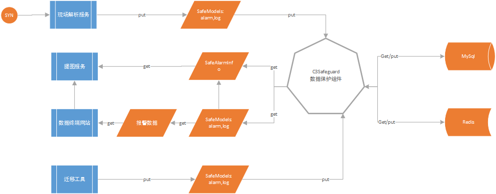

3C doc - 数据加密和解密方案
=================
  
版本修订
-----------------------------------
+ 2019/10/24  author:xuyong  add  


设计思路
-----------------------------------
3C数据的重要性不言而喻，对于一些敏感数据采用加密存储后可以在一定程度上起到保护效果。数据加密保护后，则需要通过解密才能使用，这样数据的读写就很复杂，下面就是通过统一的数据加解密和存储方案。  
1.解析服务写数据时，调用C3Safeguard数据保护组件Save方法，传入预定义好的key+Model  
2.C3Safeguard.Save将model序列化后加密存储至mysql和redis  
3.读取数据时，通过key调用C3Safeguard.Query方法获取对应的Model数据  

需要加密的数据
-----------------------------------
字典字段不必调用get接口，直接程序启动时加载缓存数据至内存的字典集合中，使用时通过KEY直接获取性能更高  
### Alarm:  
gis_x	百度经度  
gis_y	百度纬度  
gis_x_o	百度经度  
gis_y_o	百度纬度  
dir_path	虚拟目录路径  
svalue1	原始文件目录  
svalue5	可见光缺陷帧  
svalue9	全景缺陷帧  
svalue11	红外缺陷帧  
LineName	线路[字典]  
PositionName	区站[字典]  
CodeName	缺陷类型[字典]  
### ALARM_AUX:
map_add_ima	地图附加图片路径  
vi_add_ima	局部附加图片路径  
oa_add_ima	全景附加图片路径  
reportwordurl	报告路径  
### C3_SMS
gis_x	百度经度  
gis_y	百度纬度  
gis_x_o	经度  
gis_y_o	纬度  
### 字典表：名称字段加密
MIS_PARAMETER
mis_line
mis_position
sys_dic
virtual_dir_info


数据库设计
-----------------------------------
NOS_Alarm[KEY+CONTEXT]  
NOS_ALARM_AUX[KEY+CONTEXT]  
NOS_C3_SMS[KEY+CONTEXT]  
NOS_PARAMETER[KEY+CONTEXT]  
NOS_line[KEY+CONTEXT]  
NOS_position[KEY+CONTEXT]  
NOS_SYS_DIC[KEY+CONTEXT]  
NOS_VIRTUAL_DIR[KEY+CONTEXT]  


业务流程
-----------------------------------
  
  



类设计
-----------------------------------
### models 
SafeAlarmInfo {GisX:0,GisY:0,Paths：[path:"20191014162402_9_CRH2A-4067_710_0_A.scs",type:"scs",path:"20191014162402_4_CRH2A-4067_710_0_A.mv",type:"4mv"]  }  
SafeAlarmAuxInfo{}  
SafeSmsInfo{} 
SafeParameterInfo  
SafeLineInfo  
SafeParameterInfo  
SafeDicInfo  
SafeVirtualInfo  
### class
C3Safeguard  


接口调用
-----------------------------------
TODO: CODE
```c# 
// TODO
```